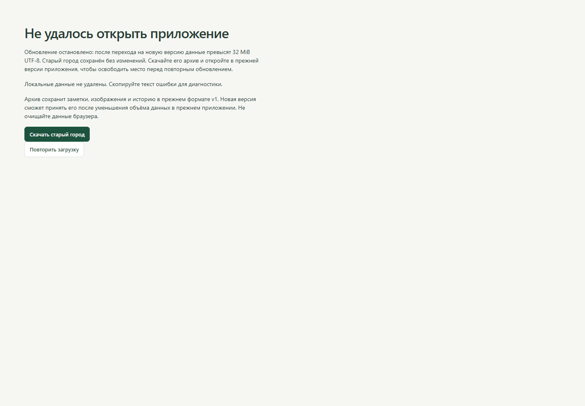
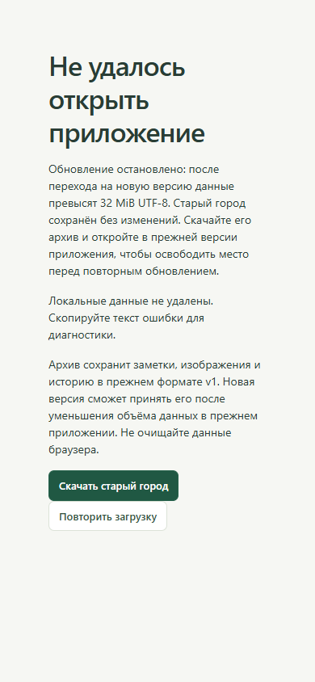

# Progress City — отчёт для ревью

## Исправление P2: размер города после миграции — 19.09.2026

**Исправлено и проверено локально поверх `21e96d6`.** Внешнее текстовое ревью указывало на валидный ZIP v1 около 32 MiB, который после добавления связей и исследований становился больше предела нового экспорта. Ошибка подтверждена настоящими `inspectArchive` → Zod → `replaceCity` и `CityDB.open`, а не только изолированным `migrateV1`. Исходный набор из семи регрессий дал **3 ожидаемых падения / 4 успешных проверки** до исправления.

### Что изменилось

- Общая сериализация проверяет размер **итогового** JSON в UTF-8 при экспорте, после преобразования импорта и непосредственно перед заменой базы. Предел остался 32 MiB; ровно предел разрешён.
- Автоматическая миграция проверяет будущий JSON v2 с метаданными всех изображений внутри versionchange-транзакции до записи. При превышении остаются схема v1, уникальный индекс здания, полный текст, изображения, события, снимки и epoch.
- Экран отказа объясняет причину и предлагает **«Скачать старый город»**. Старая база читается без upgrade, архив v1 проходит прежнюю валидацию и общий сборщик ZIP с SHA-256. Импорт переполненного старого ZIP отклоняется до предложения заменить текущий город.
- Новые функции не создают отсутствующую БД и не понижают текущую v2. Повторное открытие при том же размере сохраняет исходное состояние. Игровая механика и стоимости не менялись.

Точки просмотра: `src/storage/limits.ts`, `db.ts`, `backup.ts`, `src/features/MigrationRecovery.tsx`, `src/main.tsx`; регрессии `tests/unit/migration-limit.test.ts`, `tests/e2e/migration-limit.spec.ts`, синтетическая фабрика `tests/fixtures/migration-boundary.ts`.

### Реальные проверки этого прохода

Windows, **Node 22.23.2**, локальный **npm 12.0.2**. Использованы установленные зависимости; lockfile неизменен. Команды запускались из корня как `node .tools/package/bin/npm-cli.js run <script>`. Docker не нужен. Browser-плагин отсутствует, использован установленный проектный Playwright Chromium с одноразовыми контекстами; пользовательская база не открывалась.

| Команда | Результат |
|---|---|
| lint | PASS, exit 0 |
| typecheck | PASS, exit 0 |
| test:unit | PASS, **42/42**, 6 файлов, 9.85 с |
| test:e2e | PASS, **22/22**, 7 файлов, 1.6 мин |
| build | PASS, exit 0; прежнее предупреждение chunk >500 kB |
| test:preview | PASS, **4/4**, 22.1 с |
| git diff --check | PASS |

Восемь добавленных unit-проверок используют реальные функции с fake-indexeddb: итог v2 в 32 MiB −1/0/+1 байт для обоих путей, исходный v1 ровно 32 MiB, повторная защита прямого `replaceCity`, целостность старой базы, скачанного ZIP и отсутствие побочных эффектов восстановления. Успешные пограничные миграции действительно экспортируются и читаются обратно. В наборе 84 заметки с кириллицей и изображением: проверяются байты, а не число символов.

Два новых сценария выполнены и на dev **http://127.0.0.1:4173/**, и на собранном dist **http://127.0.0.1:4174/**:

1. Настоящая нативная IndexedDB v1 → отказ обновления → скачивание архива v1 → проверка текста, истории, изображения, размеров и SHA-256 → повтор загрузки → исходная версия 10 (Dexie v1), 84 заметки и прежний epoch.
2. Существующий текущий город → выбор валидного ZIP v1 ровно 32 MiB → сообщение об отказе → отсутствие диалога замены → неизменные город/epoch → перезагрузка с рабочим canvas.

| UI | Результат |
|---|---|
| Адрес и название | Оба тестовых origin, заголовок Progress City |
| Видимый экран | Причина отказа и рабочая загрузка старого ZIP; пустого экрана и Vite overlay нет |
| Консоль | В намеренно неуспешной миграции React сообщает пойманный OpenFailedError/MigrationLimitError; тест допускает только эту конкретную причину. Посторонних ошибок нет. В сценарии отказа импорта консоль чистая |
| Изображения | Исходные байты PNG сохранены в базе и скачанном ZIP |
| Размеры экрана | **1440×1000** и **390×844**: кнопки видимы, горизонтального переполнения нет; снимки просмотрены |

Начальный браузерный тест ожидаемо упал из-за отсутствовавшей кнопки восстановления. Следующий прогон выявил особенность записи Error в консоль React: Playwright `message.text()` показывал только DexieError, без причины. Сборщик теста теперь читает сообщение из аргумента Error и проверяет конкретную ожидаемую причину; ошибки не отключены и не скрыты. Полные финальные прогоны прошли.

### Ограничения и запуск

Это защита последующих миграций: она не восстанавливает прежнюю v1 из уже обновлённого города. Если старый город сам нарушает прежние ограничения или повреждён, восстановительный экспорт тоже откажет, оставив базу неизменной. Архив v1 предназначен для прежнего клиента (например, `0cc60ad`): после резервирования пользователь сам уменьшает объём и повторяет обновление. Автоматического обрезания материалов нет. Остальные пределы ZIP/изображений прежние.

Основной JS **1 173.36 kB**, gzip **361.45 kB**; предупреждение о размере не подавлено. Проверен Chromium со SwiftShader; Firefox/Safari, аппаратный GPU, долгосрочные квоты и все максимальные сочетания данных не проверялись. Служебное предупреждение Playwright о NO_COLOR/FORCE_COLOR не относится к приложению. Новых блокировок проверок нет.

Запуск из `C:\ProjectsForSelf\ProgressCity`: `node .tools/package/bin/npm-cli.js run dev`, открыть **http://127.0.0.1:5173/**. При обычном npm — `npm ci`, затем `npm run dev`. Подробный порядок действий при остановке миграции — README.md; факт выполнения H1–H4 — IMPLEMENTATION_PLAN.md и STATUS.md. После проверки пользователь дал постоянное указание делать коммит и push завершённых изменений в main; правило закреплено в AGENTS.md. PR и деплой не запрошены.

---

## Предыдущая итерация: кварталы (архив отчёта)

**19 сентября 2026.** Реализована итерация «От мастерской к своему кварталу» поверх 0cc60ad. На этапе реализации коммит и push не выполнялись; после приёмки пользователь отдельно разрешил их для ветки main репозитория DmitriyGrachev/ProgressiveCity. Никаких Docker, backend, облака, новых зависимостей или глобальных настроек.

## Изменение для пользователя

Одно направление теперь может занимать несколько содержательных построек: исследование/подтема/мини-проект имеют собственные материалы, следующий вопрос и этап развития. Очки остаются общими. Пользователь начинает исследование бесплатно, затем выбирает улучшение существующего объекта или строительство нового за **3 очка**. Повторное размещение и оформление бесплатны.

Редактор предлагает «Зафиксировать результат»: сначала сохраняет материал, затем открывает форму с готовыми связями и заголовком. После подтверждения появляются действия развития. Постройка открывает собственные материалы; общая коллекция и поиск сохранены. Основания расходов доступны через «Почему выросла постройка».

## Сохранность и миграция

- База с прежним именем progress-city-v1 обновляется до схемы 2 одной транзакцией. У старого учебного направления появляется initial-объект с прежним этапом. Ссылки, баланс, заметки, изображения, события и исторические этапы сохраняются.
- Уникальность перенесена с buildings.trackId на learningObjectId. У каждого объекта одна постройка и независимый этап. Привычки сохраняют прежние правила и одно здание.
- ZIP v1 строго проверяется до преобразования; новый экспорт — v2. Подтверждённая замена остаётся атомарной, повреждённый ввод не меняет текущую базу.
- Покупка/улучшение, общий баланс и событие находятся в одной транзакции. Проверены два соединения, повтор команды, конкурирующие покупка/улучшение и откат при ошибке события.
- Сохранились предыдущие проверки лимитов архива, изображений, конфликтующей копии, восстановления старого черновика при смене города и независимости сцены от автосохранения.

## Фактическая проверка

Среда: Windows, Node **24.19.0**, локальный npm **12.0.2**, установленный Playwright Chromium. Browser-плагин недоступен; использован проектный Playwright. Все браузерные данные синтетические, контексты одноразовые, пользовательский профиль не использовался.

| Проверка | Итог |
|---|---|
| npm run lint | PASS, exit 0 |
| npm run typecheck | PASS, exit 0 |
| npm run test:unit | PASS, **34/34**, 5 файлов |
| npm run test:e2e | PASS, **20/20**, 6 файлов, около минуты |
| npm run build | PASS, exit 0 |
| npm run test:preview | PASS, **2/2**, 9.0 с |

В этой среде каждая npm-команда запускалась как `node .tools/package/bin/npm-cli.js run <script>`. Новая установка зависимостей не требовалась; чистый npm ci на другой машине в этой итерации не проверялся.

Dev-проверки: **http://127.0.0.1:4173/**. Собранный dist: **http://127.0.0.1:4174/**. Viewport **1440×1000**, узкий экран **390×844**; для нового квартала проверена ширина без горизонтального переполнения. WebGL работает через SwiftShader.

| UI-проверка | Доказательство / итог |
|---|---|
| Приложение открывается | Старт, существующий город и настоящий canvas доступны; оба маршрута проходят в dist |
| Нет пустого экрана/overlay | Видимые формы, здания и изображения; просмотренные скриншоты |
| Ошибки приложения | Сквозной сценарий и архитектурная галерея не получили pageerror |
| Карта | Нажатие на вторую постройку открывает нужный объект; сохранены pan/zoom, hit testing, коллизии и исторический режим |
| Сохранение | Reload и восстановление ZIP сохраняют обе постройки, разные этапы, баланс, заметки и изображение шириной 480 px |
| Миграция | В Chromium создана настоящая нативная база v1, затем открыта новой версией; этап 2, баланс 3, изображение и epoch сохранены |
| Узкий экран | Новая панель/редактор без горизонтального переполнения; полноценное мобильное редактирование не заявляется |

Основной новый сценарий выполнен и на dev, и на dist: ZIP старого города → исследование «Студия света» в «Фотографии» → заметка с синтетическим изображением → вывод из редактора → баланс 6 → выбор между улучшением старого объекта и строительством → новая постройка за 3 → размещение через canvas → открытие только её материалов → следующий вопрос → reload → ZIP → чистый контекст. У первого объекта остался этап 2, у второго — 1; баланс после покупки 3.

## Обнаруженные и исправленные ошибки

Начальные красные тесты подтвердили отсутствие объектов/команд и чтение этапа из старой модели. Два прежних unit-теста обновлены на новое место хранения stage, без ослабления проверок баланса и истории. Первый вариант нового браузерного теста также требовал раскрыть существующий блок стартового импорта; этот сбой теста не выдавался за дефект продукта.

Независимый read-only review и дополнительные регрессии выявили:

1. Создание направления сохраняло objectId предыдущего исследования: исчезали выбор объекта и его заметки. Теперь весь связанный контекст сбрасывается; браузерный RED → GREEN.
2. Открытая форма исследования затирала новые имя/вопрос из другой вкладки. Теперь сохранены исходные epoch и поля, сравнение атомарное; при отказе ввод остаётся. Браузерный RED → GREEN.
3. Если публикация liveQuery задерживалась, быстрый переход из заметки брал старый заголовок. Теперь ResultRequest создаётся из сохранённой сессии после flush. Тест задерживает реальную подписку, RED → GREEN.
4. Архив допускал исторический этап выше текущего. Добавлена проверка отношения этапов, отказ сохраняет город; unit RED → GREEN.

Повторный read-only review не обнаружил новых существенных дефектов. Последний полный прогон завершился без падений.

## Ограничения

- Vite предупреждает о chunk >500 kB: основной JS **1 170.28 kB**, gzip **360.54 kB**. Предупреждение не подавлялось; оптимизация загрузки не входила в итерацию.
- Проверен Chromium со SwiftShader; Firefox/Safari, аппаратные GPU, длительное использование и предельные объёмы всех сущностей не проверены.
- Нет переноса существующих заметок между исследованиями, удаления объекта или возврата потраченных очков.
- Имя постройки и исследования независимы. Старые улучшения не имели ссылки на конкретный результат; миграция её не выдумывает.
- Снимок покупки создаётся до размещения нового здания. Для фиксации последующей планировки нужен ручной снимок или следующее улучшение.
- ZIP v2 и новая база несовместимы со старым клиентом. Для возврата к старой версии нужен прежний ZIP.
- Неотправленные формы и спасённые черновики живут в памяти вкладки. ZIP остаётся необходимой резервной копией; история не содержит редакций заметок.
- Нет PWA/облака/аккаунтов. Лимиты: изображение 5 MiB, data.json 32 MiB UTF-8, ZIP 64 MiB, распаковка 128 MiB. Неиспользуемые вложения не удаляются автоматически.

## Запуск и точки ревью

Из корня проекта: `npm ci`, `npm run dev`; в текущей среде — `node .tools/package/bin/npm-cli.js run dev`. Открыть **http://127.0.0.1:5173/**, использовать один и тот же origin. Docker не нужен.

Начать ревью с `storage/migrate.ts`, `db.ts`, `learning.ts`, `validation.ts`, `service.ts`, затем `features/Research.tsx`, `ActivityForm.tsx`, `notes/NoteEditor.tsx`, `city/engine.ts` и новых `quarter.test.ts` / `quarter.spec.ts`. Решения — [ARCHITECTURE.md](ARCHITECTURE.md), границы — [QUARTER_SCOPE.md](QUARTER_SCOPE.md), текущий статус — [STATUS.md](STATUS.md).

## Проверенные скриншоты

Только синтетические материалы. Реальные снимки приложения, без макетов.

