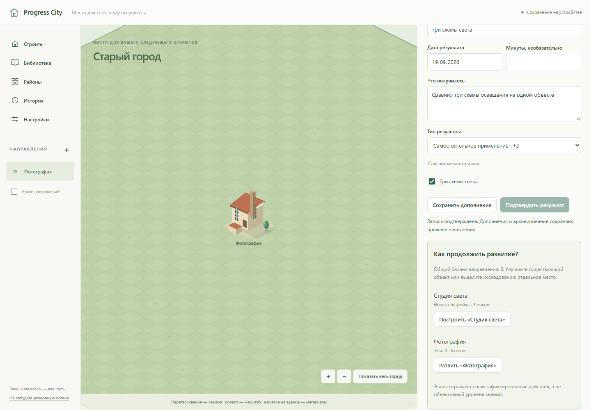
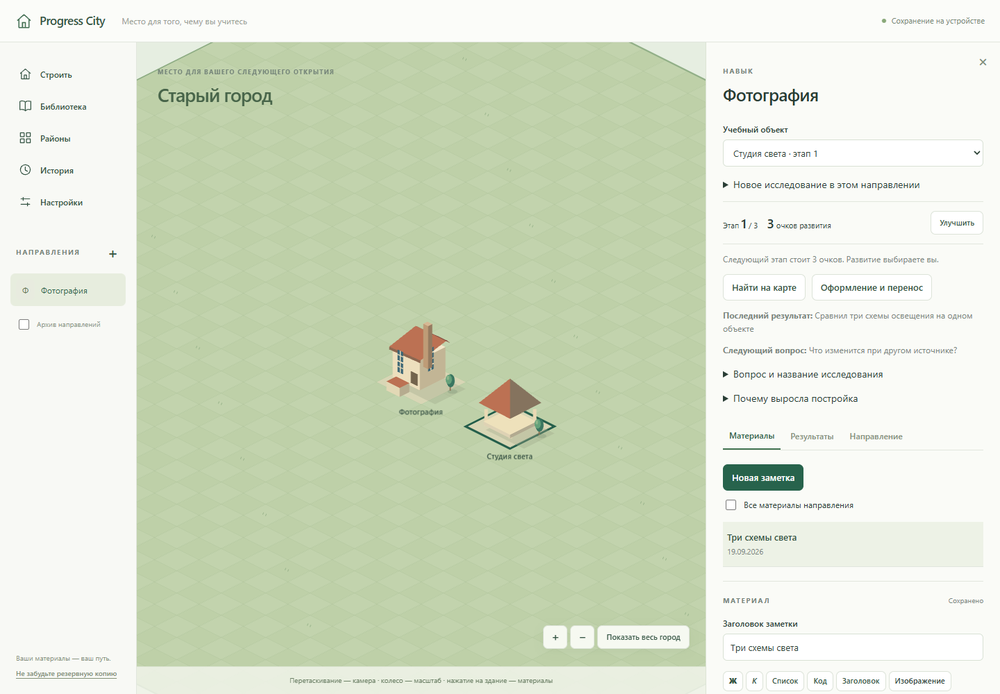
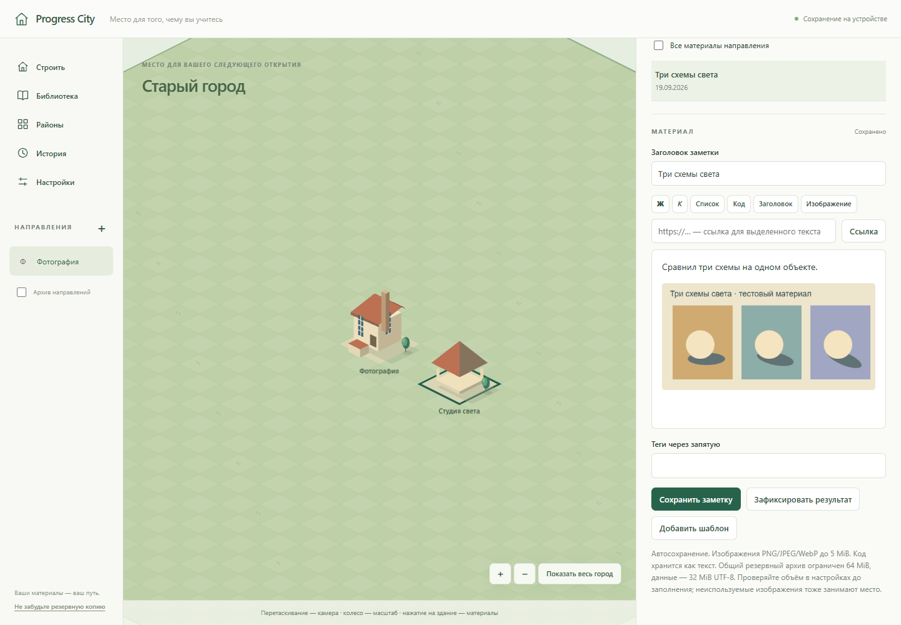
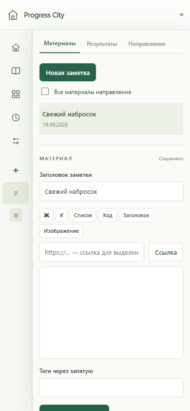

# Progress City — отчёт для ревью

**19 сентября 2026.** Реализована итерация «От мастерской к своему кварталу» поверх 0cc60ad. На этапе реализации коммит и push не выполнялись; после приёмки пользователь отдельно разрешил их для ветки main репозитория DmitriyGrachev/ProgressiveCity. Никаких Docker, backend, облака, новых зависимостей или глобальных настроек.

## Изменение для пользователя

Одно направление теперь может занимать несколько содержательных построек: исследование/подтема/мини-проект имеют собственные материалы, следующий вопрос и этап развития. Очки остаются общими. Пользователь начинает исследование бесплатно, затем выбирает улучшение существующего объекта или строительство нового за **3 очка**. Повторное размещение и оформление бесплатны.

Редактор предлагает «Зафиксировать результат»: сначала сохраняет материал, затем открывает форму с готовыми связями и заголовком. После подтверждения появляются действия развития. Постройка открывает собственные материалы; общая коллекция и поиск сохранены. Основания расходов доступны через «Почему выросла постройка».

## Сохранность и миграция

- База с прежним именем progress-city-v1 обновляется до схемы 2 одной транзакцией. У старого учебного направления появляется initial-объект с прежним этапом. Ссылки, баланс, заметки, изображения, события и исторические этапы сохраняются.
- Уникальность перенесена с buildings.trackId на learningObjectId. У каждого объекта одна постройка и независимый этап. Привычки сохраняют прежние правила и одно здание.
- ZIP v1 строго проверяется до преобразования; новый экспорт — v2. Подтверждённая замена остаётся атомарной, повреждённый ввод не меняет текущую базу.
- Покупка/улучшение, общий баланс и событие находятся в одной транзакции. Проверены два соединения, повтор команды, конкурирующие покупка/улучшение и откат при ошибке события.
- Сохранились предыдущие проверки лимитов архива, изображений, конфликтующей копии, восстановления старого черновика при смене города и независимости сцены от автосохранения.

## Фактическая проверка

Среда: Windows, Node **24.19.0**, локальный npm **12.0.2**, установленный Playwright Chromium. Browser-плагин недоступен; использован проектный Playwright. Все браузерные данные синтетические, контексты одноразовые, пользовательский профиль не использовался.

| Проверка | Итог |
|---|---|
| npm run lint | PASS, exit 0 |
| npm run typecheck | PASS, exit 0 |
| npm run test:unit | PASS, **34/34**, 5 файлов |
| npm run test:e2e | PASS, **20/20**, 6 файлов, около минуты |
| npm run build | PASS, exit 0 |
| npm run test:preview | PASS, **2/2**, 9.0 с |

В этой среде каждая npm-команда запускалась как `node .tools/package/bin/npm-cli.js run <script>`. Новая установка зависимостей не требовалась; чистый npm ci на другой машине в этой итерации не проверялся.

Dev-проверки: **http://127.0.0.1:4173/**. Собранный dist: **http://127.0.0.1:4174/**. Viewport **1440×1000**, узкий экран **390×844**; для нового квартала проверена ширина без горизонтального переполнения. WebGL работает через SwiftShader.

| UI-проверка | Доказательство / итог |
|---|---|
| Приложение открывается | Старт, существующий город и настоящий canvas доступны; оба маршрута проходят в dist |
| Нет пустого экрана/overlay | Видимые формы, здания и изображения; просмотренные скриншоты |
| Ошибки приложения | Сквозной сценарий и архитектурная галерея не получили pageerror |
| Карта | Нажатие на вторую постройку открывает нужный объект; сохранены pan/zoom, hit testing, коллизии и исторический режим |
| Сохранение | Reload и восстановление ZIP сохраняют обе постройки, разные этапы, баланс, заметки и изображение шириной 480 px |
| Миграция | В Chromium создана настоящая нативная база v1, затем открыта новой версией; этап 2, баланс 3, изображение и epoch сохранены |
| Узкий экран | Новая панель/редактор без горизонтального переполнения; полноценное мобильное редактирование не заявляется |

Основной новый сценарий выполнен и на dev, и на dist: ZIP старого города → исследование «Студия света» в «Фотографии» → заметка с синтетическим изображением → вывод из редактора → баланс 6 → выбор между улучшением старого объекта и строительством → новая постройка за 3 → размещение через canvas → открытие только её материалов → следующий вопрос → reload → ZIP → чистый контекст. У первого объекта остался этап 2, у второго — 1; баланс после покупки 3.

## Обнаруженные и исправленные ошибки

Начальные красные тесты подтвердили отсутствие объектов/команд и чтение этапа из старой модели. Два прежних unit-теста обновлены на новое место хранения stage, без ослабления проверок баланса и истории. Первый вариант нового браузерного теста также требовал раскрыть существующий блок стартового импорта; этот сбой теста не выдавался за дефект продукта.

Независимый read-only review и дополнительные регрессии выявили:

1. Создание направления сохраняло objectId предыдущего исследования: исчезали выбор объекта и его заметки. Теперь весь связанный контекст сбрасывается; браузерный RED → GREEN.
2. Открытая форма исследования затирала новые имя/вопрос из другой вкладки. Теперь сохранены исходные epoch и поля, сравнение атомарное; при отказе ввод остаётся. Браузерный RED → GREEN.
3. Если публикация liveQuery задерживалась, быстрый переход из заметки брал старый заголовок. Теперь ResultRequest создаётся из сохранённой сессии после flush. Тест задерживает реальную подписку, RED → GREEN.
4. Архив допускал исторический этап выше текущего. Добавлена проверка отношения этапов, отказ сохраняет город; unit RED → GREEN.

Повторный read-only review не обнаружил новых существенных дефектов. Последний полный прогон завершился без падений.

## Ограничения

- Vite предупреждает о chunk >500 kB: основной JS **1 170.28 kB**, gzip **360.54 kB**. Предупреждение не подавлялось; оптимизация загрузки не входила в итерацию.
- Проверен Chromium со SwiftShader; Firefox/Safari, аппаратные GPU, длительное использование и предельные объёмы всех сущностей не проверены.
- Нет переноса существующих заметок между исследованиями, удаления объекта или возврата потраченных очков.
- Имя постройки и исследования независимы. Старые улучшения не имели ссылки на конкретный результат; миграция её не выдумывает.
- Снимок покупки создаётся до размещения нового здания. Для фиксации последующей планировки нужен ручной снимок или следующее улучшение.
- ZIP v2 и новая база несовместимы со старым клиентом. Для возврата к старой версии нужен прежний ZIP.
- Неотправленные формы и спасённые черновики живут в памяти вкладки. ZIP остаётся необходимой резервной копией; история не содержит редакций заметок.
- Нет PWA/облака/аккаунтов. Лимиты: изображение 5 MiB, data.json 32 MiB UTF-8, ZIP 64 MiB, распаковка 128 MiB. Неиспользуемые вложения не удаляются автоматически.

## Запуск и точки ревью

Из корня проекта: `npm ci`, `npm run dev`; в текущей среде — `node .tools/package/bin/npm-cli.js run dev`. Открыть **http://127.0.0.1:5173/**, использовать один и тот же origin. Docker не нужен.

Начать ревью с `storage/migrate.ts`, `db.ts`, `learning.ts`, `validation.ts`, `service.ts`, затем `features/Research.tsx`, `ActivityForm.tsx`, `notes/NoteEditor.tsx`, `city/engine.ts` и новых `quarter.test.ts` / `quarter.spec.ts`. Решения — [ARCHITECTURE.md](ARCHITECTURE.md), границы — [QUARTER_SCOPE.md](QUARTER_SCOPE.md), текущий статус — [STATUS.md](STATUS.md).

## Проверенные скриншоты

Только синтетические материалы. Реальные снимки приложения, без макетов.

