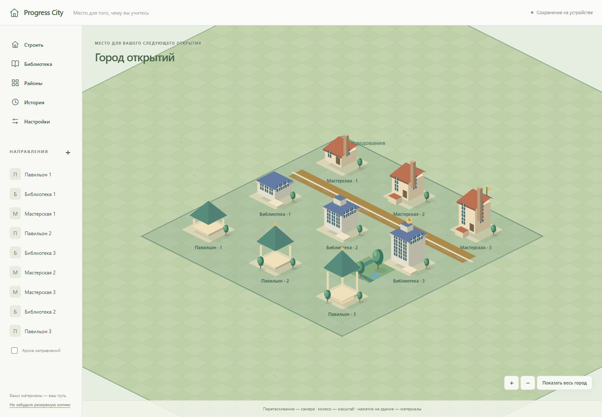
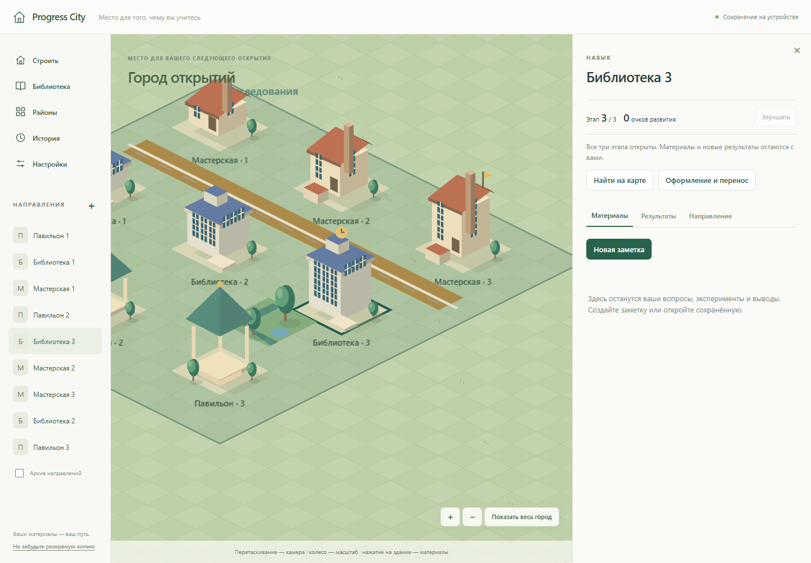
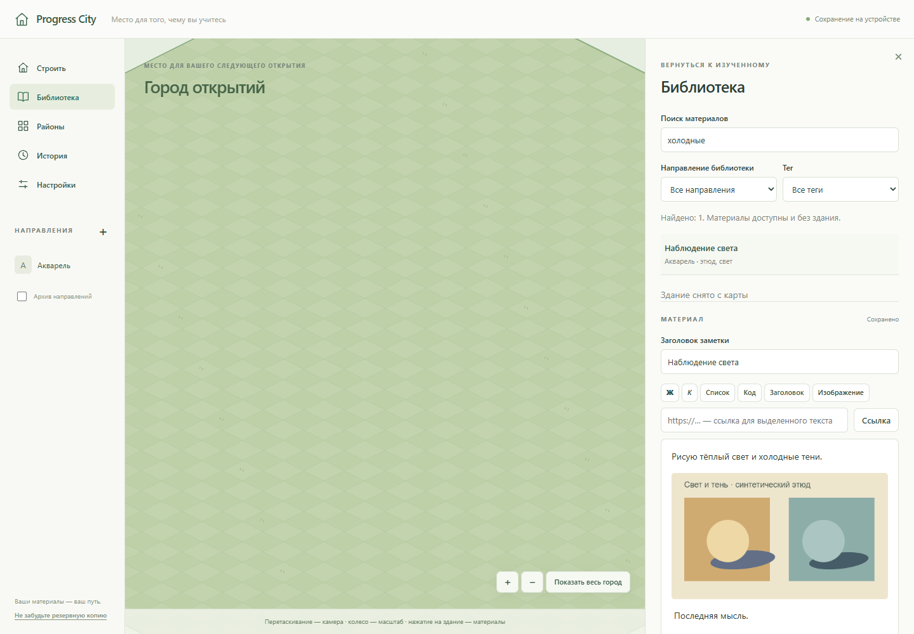
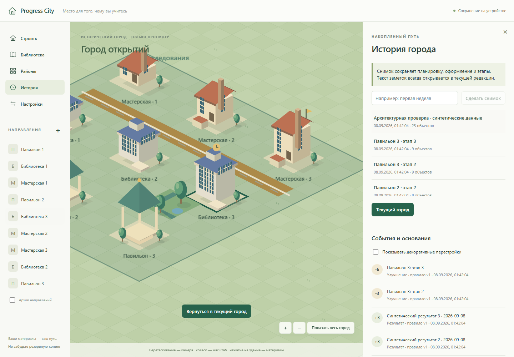
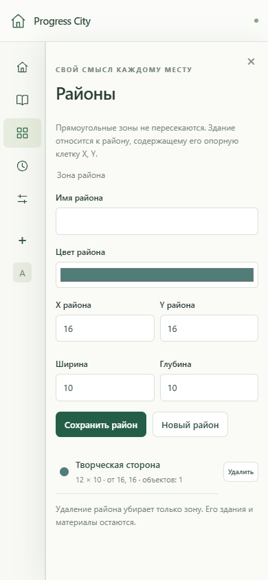

# Progress City — отчёт для ревью

Дата: 8 сентября 2026. Реализован локальный MVP по MVP_SCOPE.md. Проект запускается без Docker, сервера данных, ключей и аккаунтов. Это первая версия для личной проверки, не заявление о production-ready.

## Повторная проверка по progressivecity_diagnostics_c63a740.zip

Исправления подготовлены поверх `ee06901`; код исходного MVP совпадал с базой диагностики `c63a740`. Архив прочитан как внешнее описание замечаний; его скрипты не запускались и не копировались в приложение. Воспроизведения добавлены к настоящим функциям/браузеру текущего проекта. На этапе исправлений коммит, push, PR и деплой не выполнялись. Последующим отдельным запросом пользователь разрешил коммит и push исправлений в `main`; PR и деплой не запрошены.

### F1 — единый контракт размеров: воспроизведено и исправлено

100 заметок по 100 000 кириллических символов: настоящий exportCity вернул ZIP 40 032 205 байт, хотя data.json был больше 32 MiB. Начальный тест упал с «promise resolved … instead of rejecting». Причина — проверка data.json только при импорте. Пределы вынесены в storage/limits.ts и применяются при экспорте/распаковке; также проверяются размеры и сигнатуры исходных Blob.

Регрессии: реальный UTF-8 data.json в 32 MiB − 1 байт и ровно 32 MiB проходит export → inspect → replace с теми же заметками; +1 байт отклоняется обеими сторонами. Экспорт 13 изображений по 5 MiB отклоняется без изменения БД. Настройки показывают объёмы и предупреждение от 80%, редактор напоминает об общем пределе. Лимиты сохранены; автоматической очистки вложений нет.

### F2 — ввод во время конфликтующей копии: воспроизведено и исправлено

Unit-тест подтвердил замену нового текста старым результатом acceptSavedCopy. Браузер с детерминированной задержкой copyNote подтвердил доступный ввод во время операции. Исправление: общий disabled fieldset и readonly Tiptap, ref-защита повторного клика, ожидание pending upload/текущей записи. Навигация и visibility flush ожидают копию; ошибка возвращает доступ к вводу. acceptSavedCopy не снимает dirty с более новой версии.

Регрессии проверяют позднее изменение draft, блокировку всех полей, исходную картинку после задержанной загрузки, повторные клики, смену visibility во время операции, ошибку копирования и последующий успешный повтор. Отдельная копия создаётся одна, новый ввод и image node сохраняются, навигация работает.

### F3 — импорт из другой вкладки: воспроизведено и исправлено

Два реальных браузерных окна: ошибка записи на первом, проверенный импорт на втором. На прежнем коде не было возможности выгрузить несохранённый материал при исчезновении заметки/направления; случай прежних ID также проверен. Теперь редактор получает исходные Blob до разрешения ввода; отдельный RecoveryTray переживает размонтирование панели и промежуточный Loading. Выгрузка содержит note.txt, note.json, attachments.json и исходные изображения. Копия и загрузка проверяют epoch транзакционно и не записывают старый материал в новый город.

Регрессии проходят через библиотеку и панель направления, с отсутствующими и прежними ID. Загруженный ZIP реально прочитан тестом: последние несохранённые слова и исходные PNG-байты совпадают; в заменённой БД их нет. Unit-тест подтверждает rollback старой копии и сохранение Blob для выгрузки при отказе поздней загрузки. Ограничение: аварийный черновик живёт в памяти вкладки, не переживает сбой/перезагрузку; пользователь должен выгрузить его перед закрытием. Его ZIP предназначен для ручного переноса, не для импорта города.

### F4 — перестройка сцены: воспроизведено и исправлено

Счётчик вокруг настоящего CityEngine.update и сравнение объекта Pixi: 2 сохранения текста вызывали 2 update и 2 пересоздания объектов. После выделения подписок — **0 update / 0 пересозданий** на том же сценарии. Оболочка не перечитывает события/снимки на изменение текста, CityCanvas читает только данные карты и выбранный снимок. Старые e2e по размещению, выделению, pan/zoom, районам, улучшениям и историческому виду продолжают проходить. Это измерение числа операций; замеры FPS/аппаратного GPU не выполнялись.

Read-only рецензент выявил дополнительную гонку независимых live-query при импорте: временное смешивание notes и epoch разных поколений. Подтверждено отдельно в браузере задержкой чтения notes: старая заметка оставалась доступна после нового epoch. Каждая подписка теперь читает epoch в своей транзакции; панель получает только согласованные поколения. Тест падал до исправления и проходит после него. Других конкретных нарушений F1–F4 рецензент не нашёл; сам файлы не изменял.

### Финальные команды и фактические результаты

В этой среде команды `npm run …` выполнены как `node .tools/package/bin/npm-cli.js run …`.

| Проверка | Результат последнего полного прогона |
|---|---|
| `npm ci` | PASS: новая `.tools/clean-install`, тот же package-lock.json, 249 пакетов, 0 vulnerabilities, exit 0 |
| `npm run lint` | PASS, exit 0 |
| `npm run typecheck` | PASS, exit 0 |
| `npm run test:unit` | PASS, **27/27**, 4 файла, exit 0 |
| `npm run test:e2e` | PASS, **15/15**, 5 файлов, 43.0 с, exit 0 |
| `npm run build` | PASS, exit 0; JS chunk **1 147.66 kB / gzip 355.10 kB**, предупреждение >500 kB остаётся |
| `npm run test:preview` | PASS, **1/1**, 3.6 с, собранный dist через Vite preview на 4174, exit 0 |

Чистая установка выполнена без старого node_modules в отдельной игнорируемой папке на этой же Windows, а не на другом компьютере. `test:preview` запускает только preview и проверяет город → заметка → результат → улучшение → reload → поиск; пользовательские базы не использовались. Настоящие PNG `review-evidence/draft-recovery.png` и `review-evidence/built-mvp.png` просмотрены: текст, панели и кнопки читаемы; предупреждение об ошибке на первом — намеренно инъецированный QuotaExceededError.

Красные проверки и промежуточные ошибки не скрыты: четыре исходных дефекта, смешанный epoch, затем ошибки типов в новых тестах/обобщении Dexie исправлены. Один ошибочно перекрытый запуск Playwright дал ERR_CONNECTION_REFUSED и конфликт файлов trace; после этого все прогоны выполнялись последовательно. Последний полный прогон не содержит этих ошибок. Предупреждение ProseMirror о white-space устранено добавлением pre-wrap; предупреждение среды NO_COLOR/FORCE_COLOR остаётся.

Далее сохранён отчёт первоначальной приёмки MVP (его числа 20/9 относятся к версии до этого прохода).

## Что реализовано

| Требование | Реализация и доказательство |
|---|---|
| Старт с малого | Пустой профиль запрашивает город/направление и создаёт ровно одну мастерскую; начальный snapshot без выдуманных событий |
| Интерактивный город | PixiJS/WebGL, 40 × 40, pan/zoom относительно указателя, hit testing, предпросмотр, коллизии/границы, перенос/снятие, Escape, точные координаты |
| Кастомизация | Три шаблона × три этапа, палитры, имена, дороги, деревья, парк и площадь; редактируемые прямоугольные районы |
| Реальные результаты | Сохранение черновиков, подтверждение, тип результата, дата, длительность, ссылки на заметки, отдельное платное очками улучшение |
| Надёжные награды | Транзакции и стабильные event IDs, защита повторов/двух вкладок, версии правил без изменения прошлого |
| Привычки | Поддержание/сокращение, личная цель, расписание, граница, значение и комментарий; один ключ дня, без штрафов |
| Материалы | Tiptap JSON, текст/списки/код/ссылки/PNG/JPEG/WebP, теги, последовательное автосохранение и явная кнопка |
| Возвращение | Через здание и глобальную библиотеку, поиск текста и фильтры; материалы остаются после снятия здания и архивирования направления |
| История | Начальный/ручные/автоматические после улучшения snapshots, независимые прошлые положения и этапы, режим чтения той же картой |
| Резервирование | Согласованный ZIP с оригинальными Blob, manifest/SHA-256, строгая проверка до замены, атомарный импорт и стартовое восстановление |

## Среда и команды

Windows; Node 24.19.0; локальный npm 12.0.2; Chromium 153.0.8010.12 / Playwright 1.63.0. Интерфейс проверялся на `http://127.0.0.1:4173` в одноразовых браузерных контекстах, не в пользовательском профиле. Размеры 1440 × 1000 и 390 × 844; дополнительно стартовый экран 1280 × 720 через CUA/IAB. Browser skill не был доступен; Playwright выбран по заданию и frontend-testing-debugging.

Команды запускались реально через `node .tools/package/bin/npm-cli.js run <script>`, поскольку штатный `npm` отсутствовал в PATH. В обычной среде им соответствуют команды ниже.

| Команда | Фактический результат |
|---|---|
| `npm run lint` | PASS, exit 0, без замечаний ESLint |
| `npm run typecheck` | PASS, exit 0, strict TypeScript |
| `npm run test:unit` | PASS, 20 тестов / 4 файла, exit 0 |
| `npm run test:e2e` | PASS, 9 браузерных сценариев / 4 spec-файла, exit 0 |
| `npm run build` | PASS, exit 0; есть предупреждение о JS chunk >500 kB |

В stderr Playwright есть предупреждение среды о совместно установленных NO_COLOR/FORCE_COLOR. Это не ошибка приложения. WebGL использовал SwiftShader; отдельное измерение аппаратного GPU не выполнялось. Глобальные настройки и sandbox не менялись.

## Проверенные сценарии

- Город → заметка → результат +3 → улучшение до этапа 2 → reload → поиск сохранённого текста.
- Выбор настоящего canvas, перенос, zoom/pan и повторное попадание в здание, отклонение занятой клетки, Escape, декор, просмотр прошлого и возврат в настоящее.
- Заметка с синтетическим изображением 480 × 280, ввод после картинки, быстрое создание/переключение записей до debounce, сохранение последней мысли.
- Снятие здания → reload → поиск → изображение остаётся. Полный экспорт → новый чистый браузерный контекст → восстановление со стартового экрана → те же заметки и изображение с проверенной naturalWidth.
- Две реальные вкладки подтверждают один habit draft одновременно; две записи одной даты дают одну награду. Новая версия правила сохраняет старый event amount/ruleVersion.
- Конфликт редакций двух вкладок сохраняет обе версии через отдельную копию и разрешает дальнейшую навигацию.
- Инъекция QuotaExceededError на настоящую запись IndexedDB: нет ложного «Сохранено», текст остаётся, переход блокируется, после снятия инъекции повтор успешен. Физическое заполнение диска не имитировалось.
- Unit-регрессии: откат подтверждения при ошибке event-write; повторный расход с тем же commandId; недостаток баланса; локальные даты за UTC-границей; неизменный snapshot; архивирование не удаляет заметки; плохой ZIP/версия/путь/тип изображения; повреждённая ProseMirror-структура; отсутствующее событие подтверждения; несоответствующие лимитам заметки; полный rollback импорта; stale editor после импорта; импорт заработанного этапа не повторяет награды.

## Визуальная приёмка

Скриншоты получены реальным Playwright и просмотрены через view_image. Начальный экран дополнительно осмотрен в IAB. Концепт-арт не генерировался и не использовался по прямому указанию задания; сравнение шло с функциональным направлением MVP_SCOPE.

| Проверка | Результат |
|---|---|
| Идентичность страницы и первый экран | Заголовок Progress City, рабочая форма старта, не пустой экран |
| Карта и силуэты | Проверены все 9 сочетаний шаблона/этапа; крыши, окна, пристройки и окружение различимы |
| Панели и камера | Одна панель справа, карта сохраняет центр при изменении доступной ширины; кнопки/текст не перекрываются на desktop |
| Типографика/цвета | Единая локальная Segoe UI, светлая оболочка, зелёная карта и согласованные палитры; внешние шрифты не запрашиваются |
| Малый экран | 390 × 844, нет горизонтального overflow; панель скроллится и закрывается. Мобильное редактирование всей карты не заявлено |
| Заметки/изображения | Видно сохранённую заметку, теги, статус и исходное изображение после снятия здания |
| Ошибки браузера | В основных сценариях и архитектурной галерее нет app pageerror; галерея также проверяет console.error |
| Необоснованный UI | Нет выдуманных достижений/streak, декоративных процентов, неработающих заглушек или генерации наград за оформление |

Материальные исправления по результатам проверки: пересчёт камеры при открытии панели; блокировка ввода в старую заметку на время перехода; новый абзац после изображения; подавление ложного editor update при переключении editable; атомарное создание копии после конфликта; общая схема заметки для записи/импорта; двусторонняя проверка event-связей; epoch после восстановления; цветовые варианты декора применяются к фактическому рисунку.

## Независимое ревью

Один дополнительный агент выполнил только чтение и воспроизведения на fake-indexeddb в памяти. Его четыре P2 подтверждены и исправлены:

1. Некорректный Tiptap JSON проходил импорт — добавлена установленная ProseMirror schema.check и регрессии.
2. Сохранение конфликтующего текста копией не отпускало навигацию — копирование стало атомарным, SaveSession завершается, копия открывается; есть e2e.
3. Слишком длинный тег сохранялся, но ломал экспорт — до записи проверяется общая архивная схема, ошибочный draft остаётся.
4. Подтверждённая активность без события проходила импорт — добавлена обратная проверка ключа подтверждения, включая привычки.

## Ограничения и непроверенное

- Крупный основной JS bundle (примерно 1.14 MB, gzip 353 kB) из-за редактора/движка. Сборка успешна, но оптимизация загрузки отложена; предупреждение не скрывалось.
- Нет обещания FPS на больших городах, длительных сессиях или аппаратных GPU. Проверены синтетические небольшие города, не месяцы личной эксплуатации и не максимальные объёмы архива.
- Лимиты архивов и сущностей описаны в README/ARCHITECTURE. За пределами лимитов экспорт отклоняется без удаления базы. Неиспользуемые вложения пока сохраняются, автоматической сборки мусора нет.
- Поддерживается настольный Chromium. Firefox/Safari и полноценное мобильное управление не проверялись.
- История хранит планировку и этапы, не прошлые тексты. Настоящее состояние камеры после reload начинается заново. Импорт — замена, не слияние.
- Расписание привычки текстовое, без календаря уведомлений. Никаких клинических оценок или объективной проверки освоения.
- Автосохранение не может гарантировать запись при аварийном завершении браузера/ОС. При ошибке записи черновик остаётся в памяти до закрытия; требуется повтор или копирование текста. Локальная база не заменяет пользовательский ZIP.
- Установка на другой машине не проверялась. Чистый npm ci на текущей машине и основной браузерный маршрут собранного dist выполнены в повторной проверке выше.

## Что смотреть на ревью

Сначала `src/storage/service.ts`, `validation.ts`, `backup.ts`, затем `src/notes/save-session.ts`, `NoteEditor.tsx`, `src/city/engine.ts`, `tests/unit` и `tests/e2e`. Общая схема — ARCHITECTURE.md, актуальный итог — STATUS.md. Исходные пользовательские документы сохранены. На этапе реализации коммитов, push, PR и деплоя не было. Позднее пользователь отдельно запросил первый коммит и push в `DmitriyGrachev/ProgressiveCity`; PR и деплой не запрошены.

Скриншоты (только синтетические данные; галерея не является стартовым городом):

